# 🍕 Where's My Pizza? - Restaurant Management System


A modern, distributed restaurant management system built with Go, PostgreSQL, and RabbitMQ. This microservices-based application handles order processing, kitchen workflow, order tracking, and real-time notifications.


## 📋 Table of Contents

- [Features](#-features)
- [Architecture](#-architecture)
- [Microservices](#-microservices)
- [Installation](#-installation)
- [API Documentation](#-api-documentation)
- [Usage Examples](#-usage-examples)
- [Development](#-development)
- [Deployment](#-deployment)

## ✨ Features

### 🚀 Core Functionality
- **Order Management**: Create and track orders with real-time status updates
- **Kitchen Workflow**: Specialized workers for different order types (dine-in, takeout, delivery)
- **Real-time Tracking**: Monitor order status and kitchen worker availability
- **Notifications**: Instant status updates for order progression

### 🛠 Technical Features
- **Microservices Architecture**: Independently scalable services
- **Message Queue**: RabbitMQ for reliable inter-service communication
- **Database Persistence**: PostgreSQL with proper transactions and data integrity
- **Structured Logging**: JSON-formatted logs with request tracing
- **Graceful Shutdown**: Proper handling of termination signals
- **Docker Support**: Containerized deployment with Docker Compose

## 🏗 Architecture

```mermaid
graph TB
    Client[📱 Client] --> OrderService[📦 Order Service]
    OrderService --> DB[(💾 PostgreSQL)]
    OrderService --> MQ[🐇 RabbitMQ]
    MQ --> KitchenService[👨‍🍳 Kitchen Service]
    KitchenService --> DB
    KitchenService --> MQ
    MQ --> NotificationService[🔔 Notification Service]
    TrackingService[📊 Tracking Service] --> DB
    Client --> TrackingService
```




## 🧩 Microservices

### 📦 Order Service (`--mode=order-service`)
**Port: 3000**

Handles order creation, validation, and publishing to the message queue.

```bash
./restaurant-system --mode=order-service --port=3000
```

### 👨‍🍳 Kitchen Worker (`--mode=kitchen-worker`)
Processes orders based on specialization (dine-in, takeout, delivery).

```bash
# General worker (handles all order types)
./restaurant-system --mode=kitchen-worker --worker-name="chef_anna"

# Specialized worker (dine-in orders only)
./restaurant-system --mode=kitchen-worker --worker-name="chef_mario" --order-types="dine_in"

# Specialized worker (takeout orders only)
./restaurant-system --mode=kitchen-worker --worker-name="chef_luigi" --order-types="takeout"

# Specialized worker (delivery orders only)
./restaurant-system --mode=kitchen-worker --worker-name="chef_peach" --order-types="delivery"
```

### 📊 Tracking Service (`--mode=tracking-service`)
**Port: 3002**

Provides order status and kitchen worker information.

```bash
./restaurant-system --mode=tracking-service --port=3002
```

### 🔔 Notification Service (`--mode=notification-subscriber`)
Subscribes to order status updates and displays notifications.

```bash
./restaurant-system --mode=notification-subscriber
```

## 🚀 Installation

### Prerequisites
- Go 1.25+
- PostgreSQL 15+
- RabbitMQ 3.12+
- Docker and Docker Compose (optional)

### Local Development
1. **Clone the repository**
   ```bash
   git clone https://github.com/your-username/wheres-my-pizza.git
   cd wheres-my-pizza
   ```

2. **Set up database**
   ```bash
   # Create database and user
   sudo -u postgres psql
   CREATE DATABASE restaurant_db;
   CREATE USER restaurant_user WITH PASSWORD 'restaurant_pass';
   GRANT ALL PRIVILEGES ON DATABASE restaurant_db TO restaurant_user;
   ```

3. **Run migrations**
   ```bash
   # The application will automatically run migrations on startup
   ```

4. **Build the application**
   ```bash
   go build -o restaurant-system .
   ```

5. **Start RabbitMQ** (if not using Docker)
   ```bash
   # On macOS
   brew services start rabbitmq
   
   # On Ubuntu
   sudo systemctl start rabbitmq-server
   ```

### Docker Deployment
1. **Start all services with Docker Compose**
   ```bash
   docker-compose up --build
   ```

   This will start:
    - PostgreSQL database
    - RabbitMQ with management UI (port 15672)
    - Order service (port 3000)
    - Tracking service (port 3002)
    - Notification service
    - Three specialized kitchen workers (dine-in, takeout, delivery)

2. **Access services**
    - Order API: http://localhost:3000
    - Tracking API: http://localhost:3002
    - RabbitMQ Management: http://localhost:15672 (guest/guest)

## 📚 API Documentation

### Order Service Endpoints

#### Create Order
```http
POST /orders
Content-Type: application/json
```

**Request Body:**
```json
{
  "customer_name": "John Doe",
  "order_type": "takeout",
  "items": [
    { "name": "Margherita Pizza", "quantity": 1, "price": 15.99 },
    { "name": "Caesar Salad", "quantity": 1, "price": 8.99 }
  ]
}
```

**Response:**
```json
{
  "order_number": "ORD_20241216_001",
  "status": "received",
  "total_amount": 24.98
}
```

#### Get Orders (Paginated)
```http
GET /orders?page=1&limit=10
```

**Response:**
```json
{
  "orders": [
    {
      "id": 1,
      "number": "ORD_20241216_001",
      "customer_name": "John Doe",
      "type": "takeout",
      "status": "ready",
      "total_amount": 24.98,
      "created_at": "2024-12-16T10:30:00Z"
    }
  ],
  "total": 15,
  "page": 1,
  "limit": 10
}
```

#### Get Order Details
```http
GET /orders/ORD_20241216_001
```

**Response:**
```json
{
  "id": 1,
  "number": "ORD_20241216_001",
  "customer_name": "John Doe",
  "type": "takeout",
  "table_number": null,
  "delivery_address": null,
  "total_amount": 24.98,
  "priority": 1,
  "status": "ready",
  "processed_by": "chef_anna",
  "completed_at": "2024-12-16T10:42:00Z",
  "created_at": "2024-12-16T10:30:00Z",
  "updated_at": "2024-12-16T10:42:00Z",
  "items": [
    {
      "id": 1,
      "name": "Margherita Pizza",
      "quantity": 1,
      "price": 15.99,
      "created_at": "2024-12-16T10:30:00Z"
    },
    {
      "id": 2,
      "name": "Caesar Salad",
      "quantity": 1,
      "price": 8.99,
      "created_at": "2024-12-16T10:30:00Z"
    }
  ]
}
```

### Tracking Service Endpoints

#### Get Order Status
```http
GET /orders/ORD_20241216_001/status
```

**Response:**
```json
{
  "order_number": "ORD_20241216_001",
  "current_status": "cooking",
  "updated_at": "2024-12-16T10:32:00Z",
  "estimated_completion": "2024-12-16T10:42:00Z",
  "processed_by": "chef_mario"
}
```

#### Get Order History
```http
GET /orders/ORD_20241216_001/history
```

**Response:**
```json
[
  {
    "status": "received",
    "timestamp": "2024-12-16T10:30:00Z",
    "changed_by": "system"
  },
  {
    "status": "cooking",
    "timestamp": "2024-12-16T10:32:00Z",
    "changed_by": "chef_mario"
  },
  {
    "status": "ready",
    "timestamp": "2024-12-16T10:42:00Z",
    "changed_by": "chef_mario"
  }
]
```

#### Get Workers Status
```http
GET /workers/status
```

**Response:**
```json
[
  {
    "worker_name": "chef_mario",
    "status": "online",
    "orders_processed": 5,
    "last_seen": "2024-12-16T10:35:00Z"
  },
  {
    "worker_name": "chef_luigi",
    "status": "offline",
    "orders_processed": 3,
    "last_seen": "2024-12-16T10:30:01Z"
  }
]
```

## 🎯 Usage Examples

### Creating an Order
```bash
curl -X POST http://localhost:3000/orders \
  -H "Content-Type: application/json" \
  -d '{
    "customer_name": "Jane Doe",
    "order_type": "delivery",
    "delivery_address": "123 Main St, City, State 12345",
    "items": [
      {"name": "Pepperoni Pizza", "quantity": 2, "price": 18.99},
      {"name": "Garlic Bread", "quantity": 1, "price": 5.99}
    ]
  }'
```

### Tracking an Order
```bash
# Get order status
curl http://localhost:3002/orders/ORD_20241216_001/status

# Get order history
curl http://localhost:3002/orders/ORD_20241216_001/history

# Get kitchen staff status
curl http://localhost:3002/workers/status
```

### Viewing All Orders
```bash
curl "http://localhost:3000/orders?page=1&limit=20"
```

## 🔧 Development

### Project Structure
```
restaurant-system/
├── cmd/                 # Service entry points
│   ├── kitchen/        # Kitchen worker service
│   ├── notification/   # Notification service
│   ├── order/          # Order service
│   └── tracking/       # Tracking service
├── config/             # Configuration files
├── internal/           # Internal packages
│   ├── kitchen/        # Kitchen service logic
│   ├── notification/   # Notification service logic
│   ├── order/          # Order service logic
│   └── tracking/       # Tracking service logic
├── migrations/         # Database migrations
├── pkg/                # Shared packages
│   ├── logger/         # Structured logging
│   ├── postgres/       # PostgreSQL utilities
│   ├── rabbitmq/       # RabbitMQ utilities
│   └── yaml/           # YAML configuration parser
├── docker-compose.yml  # Docker Compose configuration
└── main.go            # Application entry point
```


## 📄 License

This project is licensed under the MIT License - see the [LICENSE](LICENSE) file for details.


## 🙏 Acknowledgments

- Go community for excellent tools and libraries
- PostgreSQL and RabbitMQ teams for robust data and messaging solutions
- Docker for containerization platform
- All contributors who helped shape this project

---


**Where's My Pizza?** - Making restaurant management deliciously efficient! 🍕⚡

---